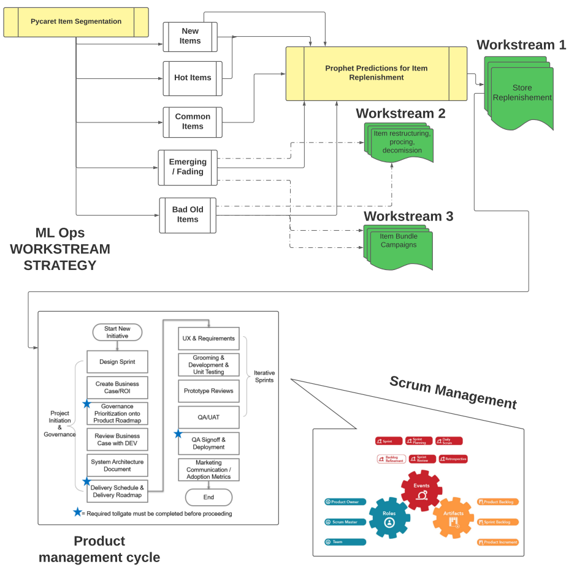
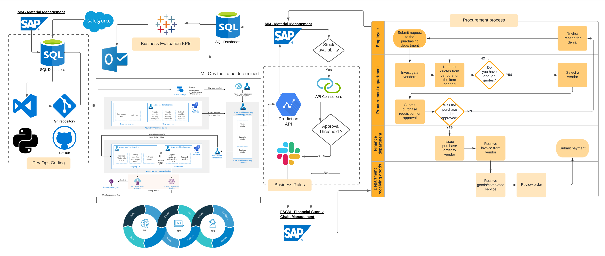

<h1>DSmarket</h1>

# Project DS Market

This project consist on 4 parts working on the DS_MARKET data.

- Business Analysis
- Items clustering
- Product sales predictions
- MLOps plan for a store supply use case

# Installation

The project is stored in:

    https://github.com/lukyluca/DS_market_project

# Requirements

Python version 3.8

All packages in the used environment are reported in the files:

    requirements_1.txt requirements_2.txt requirements_3.txt

There is a requirement file for each subproject.

# Part 1: Business Analysis
In this part we will review all the different business aspects of DS supermaket. This review will be based on unit sales as well as unit revenue

## Getting Started
To run the notebooks, it is first necessary to run the "dollar_value_table.ipynb" notebook. This is because running this specific notebook will generate a new csv fille that is used in the other notebooks. In this notebook we have created a dataframe with the dollar revnue per unit sold per day, based on the other available tables. Once saved, The csv file was too large to store dircetly in the repository. The DS_market_data folders contains all other csv/zip file that are imported in the notebooks. The "Dashboar_data" folder contains several csv/Xlsx files which we have used to fead our dashboard

# Part 2: Item clustering

The clustering part works on the item_sales.csv.
The clustering part is aiming in identifying products that behave similarly.

The data from the Tribeca store (most selling store) were used to create the clusters.

Clustering features created are: frequency (total number of sold products per item) and recency (days since last purchased).
For the model creation the features were log transformed since their distribution was not gaussian.

95% of the Tribeca data was used to train the model, 5% for testing.

Data normalization was performed within Pycaret with MinMax scaler.

A k-means model with number of cluster = 5 has been created.
The elbow curve was used to find the best number of clusters.

The cluster model is saved as cluster_model_items.pkl
The cluster model is applied to all other stores and results saved in csv files.

Cluster interpretation
---------------------

The cluster identified can be interpreted as follow:

* Cluster 0 - Transition Items:Cluster with medium recency and a wide range in frequency: they could be emerging products (lower-left part of the cluster) or fading products (upper-right) part of the cluster;
* Cluster 1 - Common Items: Cluster with medium frequency and low recency: these are common products, should be most of the product and as a matter of fact it is the cluster with more items;
* Cluster 2 - Hot Items: Cluster with high frequency and low recency: these are the hot/top selling products
* Cluster 3 - Old or Bad Items: Cluster withhigh recency and a wide range in frequency: they could be bad products, that never sold (lower part of the cluster) or old product (left part of the cluster) that sold in the past but now are not selling anymore
* Cluster 4 - New Items: Cluster with low frequency and low recency: there are new/appearing products

# Part 3: Product sales predictions

* For this part we need to run the dollar value table again in order to have all the requiered csv file to run the notebook. Once the dollar csv is obtained, we need to take the apropriate store cluster to be predicted from part 2 (Tribeca in this case). 

* Then we will need to create a list of dataframes with data to be fitted in the model, with the help of the function prophet_df(dataframe, item_select). Note item_selected is a list of products to be selected within a df, if we want to select all the items just set items_selected = df.id.unique().index to get the index of all the products in the df.

* Then use the Hypermameter loop to find the best parameters for the cluster

* Finally generate a model and predict the units sold of each product with the mapping of the run_prophet() function. The model with automatically be saved for future use.
=======

# Part 4: MLOps plan for a store supply use case

Models are to branch out into multiple workstreams, the main workstream is the Store replenishment use case. 
Standard Product management cycles will be observed through to deployment and monitoring until closure of project. 
Standard Scrum management process will be deployed within the management of sprints.  
Kanban boards will be used to manage tasks using tools such as Trello or java to manage backlog.

Data sources input from SAP and Salesforce relating to sales, events and prices. 
Data engineering and coding will be occurring through VS Studio
Git being the repository and collaboration venue
ML Ops is to be determined- in diagram; we are looking at azure.
Api to connect prediction models to SAP Material Management system to trigger workflows and business rules that would initiate automation.
Slack will be used as an approval workflow tool and a communication medium
SAP FSCM Module will once again be consulted to trigger automated Purchase orders and payment approvals
This would lead back to SAP material Management to update stock 
Tableau will be used as dashboards to measure business evaluation KPIs
Automated reports will be made available through outlook. Governance triggers will be also sent through Outlook and Slack. 
Tabpy will be used to link VS Studio and Python if MLOps tool has limitations on Business reporting data

